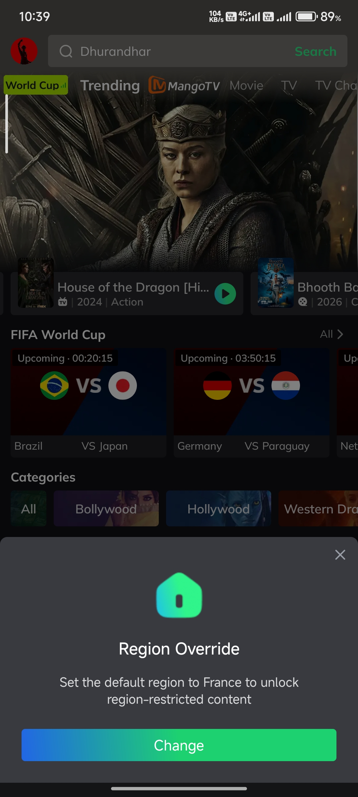
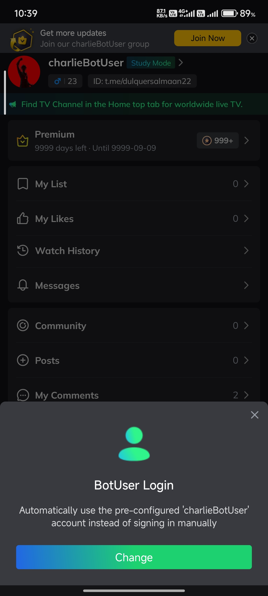
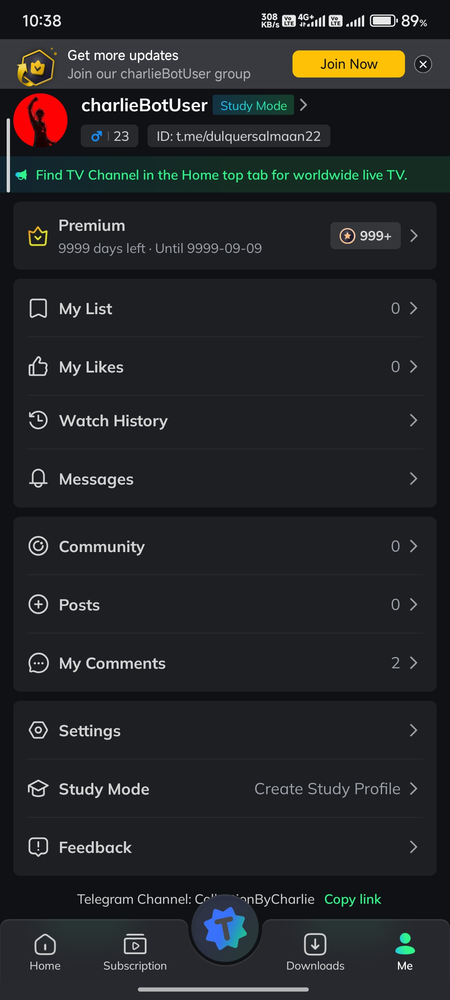
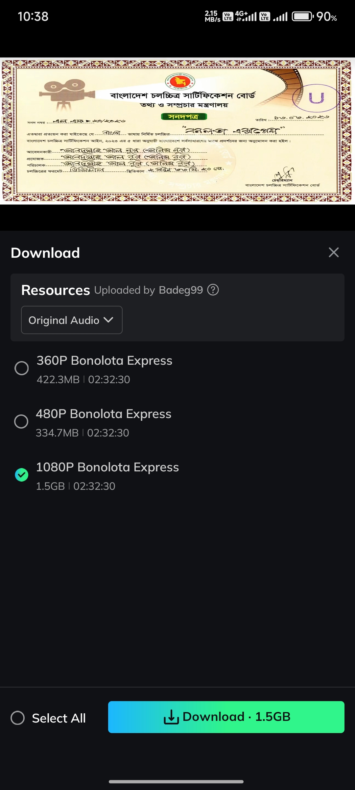

  
  
  <h2>What is MovieBox Mod?</h2>
  
MovieBox Mod is a modified version of MovieBox that unlocks premium features and provides an ad-free experience. It allows users to stream and download a vast library of movies, TV shows, anime, and live content in high quality, with additional features and enhancements.

<b> Mod Features: Premium Unlocked, No Ads, Auto Login, 1080p+ Streaming & Downloads, Extra Features</b>

  
  

    If you find this project useful, consider joining our Telegram community for the latest updates, announcements, and support.
  

 

<table width="100%">
  <tr>
    <th align="left" width="50%">App Name</th>
    <th align="center" width="50%">MovieBox Premium</th>
  </tr>
  <tr>
    <td align="left"><b>App Version</b></td>
    <td align="center">3.0.16.0616.03</td>
  </tr>
  <tr>
    <td align="left"><b>Requirement</b></td>
    <td align="center">5.0 and above</td>
  </tr>
  <tr>
    <td align="left"><b>Size</b></td>
    <td align="center">65MB+</td>
  </tr>
  <tr>
    <td align="left"><b>Category</b></td>
    <td align="center">Entertainment</td>
  </tr>
  <tr>
    <td align="left"><b>Last Update</b></td>
    <td align="center">29 June 2026</td>
  </tr>
  <tr>
    <td align="left"><b>Price</b></td>
    <td align="center">Free</td>
  </tr>
  <tr>
    <td align="left"><b>Visitors</b></td>
    <td align="center">
      
    </td>
  </tr>
  <tr>
    <td align="left"><b>Number of Downloads</b></td>
    <td align="center">
      
    </td>
  </tr>
  <tr>
    <td align="left"><b>Mod By</b></td>
    <td align="center">
      <a href="https://t.me/dulquersalmaan22">Dulquer Salmaan</a>
    </td>
  </tr>
  <tr>
  <td colspan="2" align="center">
     

    <!-- Top 2 screenshots -->
    
    

      

    <!-- Bottom 2 screenshots -->
    
    
  </td>
</tr>
</table>

   
  
    

## Join Community

| 💬 Support Group | 📢 Official Channel |
| :---: | :---: |
|  |  |

  

